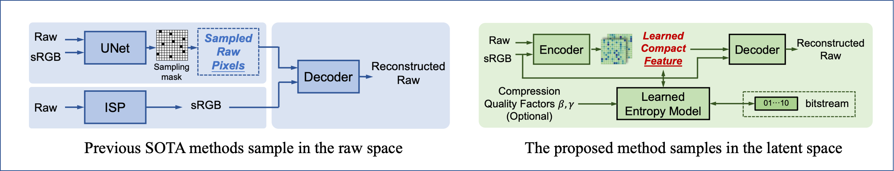
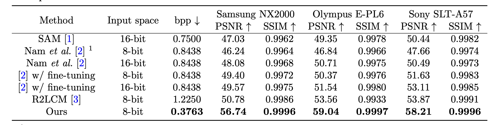

# [CVPR'23/IJCV'24] Raw Image Reconstruction with Learned Compact Metadata

This repo is for the following two works:

**Raw Image Reconstruction with Learned Compact Metadata** [[Paper]](https://arxiv.org/pdf/2302.12995.pdf) 
<br>_Yufei Wang, Yi Yu, Wenhan Yang, Lanqing Guo, Lap-Pui Chau, Alex Kot, Bihan Wen_<br>
In CVPR'2023

**Beyond Learned Metadata-based Raw Image Reconstruction** [[Paper]](https://arxiv.org/pdf/2306.12058.pdf) 
<br>_Yufei Wang, Yi Yu, Wenhan Yang, Lanqing Guo, Lap-Pui Chau, Alex Kot, Bihan Wen_<br>
In IJCV'2024


## News
- Our extension work "**Beyond Learned Metadata-based Raw Image Reconstruction**" is available at [Arxiv](https://arxiv.org/pdf/2306.12058.pdf), which has a better rate-distortion performance and covers a wider range of bpp.
## Overall 
### Motivation

Different from the previous
work where the sampling strategy is hand-crafted or learned by a pre-defined sampling loss, we learn the sampling and reconstruction process in a unified end-to-end manner. In addition, the sampling of previous works is in the raw pixel space, which in fact still includes a large amount of spatial redundancy and precision redundancy. Instead, we
conduct sampling in the feature space, and more compact metadata is obtained for pixels in the feature space via the adaptive allocation. The saved metadata is annotated in the dashed box. Compared with our conference version [3], we propose
a variable bit rate strategy that can continuously converge a large range of bit rates. Besides, better RD performance is achieved by the improved entropy model and backbone design

### Results on NUS dataset



The above is the quantitative results on NUS dataset processed and released by [github link](https://github.com/SamsungLabs/content-aware-metadata) where the sRGB is uncompressed.

## Get Started
### Dependencies and Installation
1. Clone Repo
git clone https://github.com/wyf0912/R2LCM.git
2. Create Conda Environment
conda create --name R2LCM
conda activate R2LCM   
3. Install Dependencies
```cd R2LCM
pip install -e .
```

### Dataset
- For the evaluation on NUS dataset, we recommend to use the same setting with [previous work](https://github.com/SamsungLabs/content-aware-metadata) by using down-scaled dataset after postprocess
- The dataset can be downloaded through the [link](https://ln5.sync.com/dl/9bf21ed40/z6bn94xs-uiaeij3m-rc3izeje-3epv2uz7/view/default/13870041630008)

## Pretrained Models
The pretrained models can be downloaded in the following tables

### The models in Table 1 and Fig. 15 of the [paper](https://arxiv.org/pdf/2306.12058.pdf)

| Model | Download Link |
| - | - |
| Sony | [google drive](https://drive.google.com/file/d/19IFLxyreqNOWA573phNyvBUBwRwmXHtt/view?usp=sharing) |
| Samsung | [google drive](https://drive.google.com/file/d/1xcEAgJztsI6QWaEpjqQzrYolKvHPzwZc/view?usp=sharing) |
| Olympus | [google drive](https://drive.google.com/file/d/1W5mWZcgBr7HGP4NlpURX9TTNmVHfKCDZ/view?usp=drive_link) |

## Test
Before running the testing script, you need to do the following steps first
- Downloading the dataset and change the change the value of --dataset to the path of dataset that you saved 
- Change the path of the checkpoint to the you downloaded one in *examples/config_files/journal_cvpr22_J4.py* correspondingly.

You can get the main results in Table 1 and Fig. 15 of the [paper](https://arxiv.org/pdf/2306.12058.pdf) by running the following commands,
```bash
# The results and error map will be saved into ./results
sh scripts/test_nus_cvpr22.sh
```
which will evalute the peformance of the model on three devices with different bpps.

## Train
You can train models reported in Table 1 and Fig. 15 of the [paper](https://arxiv.org/pdf/2306.12058.pdf) by running the following commands,

```bash
# You need to change the value of --dataset to the path of dataset that you saved

# Sony
CUDA_VISIBLE_DEVICES=0 python3 examples/train_raw.py --quality 1 --model learned_context_journal4 --reduce-c 8 --dataset /home/Dataset/DatasetYufei/content_aware_reconstruction/SonyA57/ --lambda 0.24 --batch-size 8 --train sony --patch-size 256 --patience 40 --epochs 1000 --sampling-num 4 --val _ --use-deconv --num-workers 8 --stride 2 --adaptive_quant --rounding noise --nocompress --print_freq 300 --test_freq 1 -lr 1e-4 --file_type tif --cache --info _CVPR22_AuxForward --l1 --down_num 2 --rounding_aux forward 

# SamsungNX2000
CUDA_VISIBLE_DEVICES=0 python3 examples/train_raw.py --quality 1 --model learned_context_journal4 --reduce-c 8 --dataset /home/Dataset/DatasetYufei/content_aware_reconstruction/SamsungNX2000/ --lambda 0.24 --batch-size 8 --train samsung --patch-size 256 --patience 40 --epochs 1000 --sampling-num 4 --val _ --use-deconv --num-workers 0 --stride 2 --adaptive_quant --rounding noise --nocompress --print_freq 300 --test_freq 1 -lr 1e-4 --file_type png --cache --info _CVPR22_AuxForward --l1 --down_num 2 --rounding_aux forward

# OlympusEPL6
CUDA_VISIBLE_DEVICES=3 python3 examples/train_raw.py --quality 1 --model learned_context_journal4 --reduce-c 8 --dataset /home/Dataset/DatasetYufei/content_aware_reconstruction/OlympusEPL6/ --lambda 0.24 --batch-size 8 --train olympus --patch-size 256 --patience 40 --epochs 1000 --sampling-num 4 --val _ --use-deconv --num-workers 0 --stride 2 --adaptive_quant --rounding noise --nocompress --print_freq 300 --test_freq 1 -lr 1e-4 --file_type tif --cache --info _CVPR22_AuxForward --l1 --down_num 2 --rounding_aux forward
```


## Some useful scripts
Here are some scripts which maybe useful.

| File name | Usage |
| - | - |
| ./jpg_bpp.py | Calculate the bpp of the JPEG dataset given the specific image quality|
| ./remove_boarder.py | Remove the boarder of the error map drawn by the seaborn |


# Citation
If you find our work useful for your research, please cite our papers
```
@inproceedings{wang2023raw,
  title={Raw image reconstruction with learned compact metadata},
  author={Wang, Yufei and Yu, Yi and Yang, Wenhan and Guo, Lanqing and Chau, Lap-Pui and Kot, Alex C and Wen, Bihan},
  booktitle={Proceedings of the IEEE/CVF Conference on Computer Vision and Pattern Recognition},
  pages={18206--18215},
  year={2023}
}

@article{wang2023beyond,
  title={Beyond Learned Metadata-based Raw Image Reconstruction},
  author={Wang, Yufei and Yu, Yi and Yang, Wenhan and Guo, Lanqing and Chau, Lap-Pui and Kot, Alex C and Wen, Bihan},
  journal={arXiv preprint arXiv:2306.12058},
  year={2023}
}
```

Please feel free to contact me if you have any questions yufei001@ntu.edu.sg.

# Acknowledgement & License
We borrow the codes from [CompressAI](https://github.com/InterDigitalInc/CompressAI) which is under the BSD 3-Clause Clear License.

Our work is for non-commerical usage.
